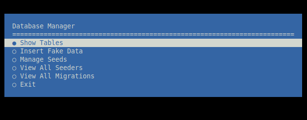
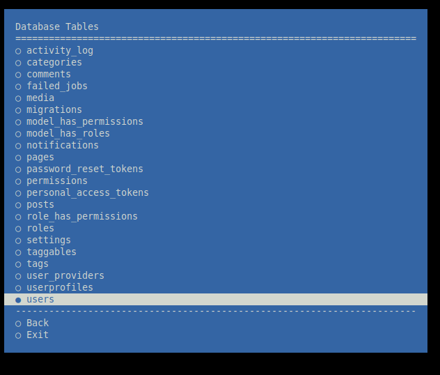
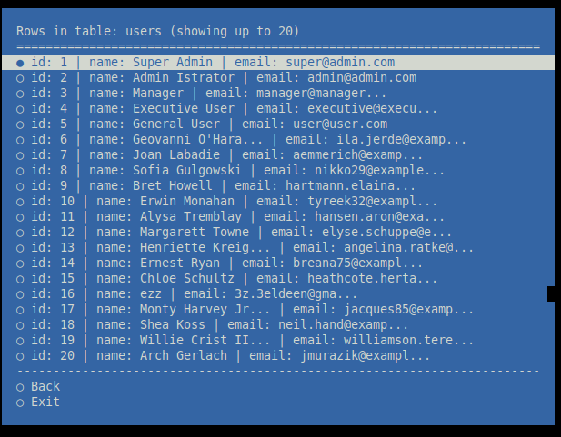
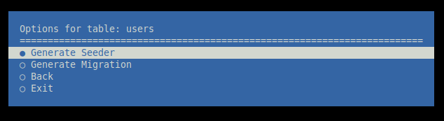

# DbManager

DbManager is a Laravel Artisan command to manage your database interactively via the console. It allows you to explore tables, view records, generate fake data, and create migrations and seeders.

---

## Features

- List all database tables
- View rows in tables with summarized columns
- Drill down to row details
- Insert fake data into tables with Faker
- Generate migration files for tables
- Generate seeder classes for tables
- Handles foreign key relationships when inserting fake data

---
##  Screenshot  




## Installation

1. Clone or download the repository into your Laravel project:

```bash
git clone https://github.com/ezmu/Db-Manager.git
```

2. Ensure the command file is located in:

```
app/Console/Commands/DbManager.php
```

3. Register the command in `app/Console/Kernel.php`:

```php
protected $commands = [
    \App\Console\Commands\DbManager::class,
];
```

---

## Usage

Run the command using Artisan:

```bash
php artisan db:manage
```

You will see an interactive menu.

---

## Menu Overview

1. **Main Menu**

   - Show Tables
   - Insert Fake Data
   - Manage Seeds
   - View All Seeders
   - View All Migrations

2. **Show Tables**

   - Lists all tables in the database
   - Select a table to view its rows

3. **Table Rows**

   - Displays rows in the selected table (summary view)
   - Select a row to see full details

4. **Row Details**

   - Shows all columns for the selected row

5. **Insert Fake Data**

   - Select a table to insert fake data
   - Automatically handles foreign key dependencies

6. **Manage Seeds**

   - Generate seeder classes for tables
   - View existing seeders and their related tables

7. **View Migrations**

   - Lists migration files
   - Displays the fields and types for each table

---

## Dependencies

- PHP 8+
- Laravel 8+
- `fakerphp/faker`
- `doctrine/dbal`
- Symfony Console (included with Laravel)

---

## Notes

- Faker generates realistic data for testing.
- Doctrine DBAL is used for schema introspection.
- Supports MySQL, PostgreSQL, SQLite, and SQL Server.

---

## License

MIT License


## Author

EzEldeen A. Y. Mushtaha 
GitHub: https://github.com/ezmu
LinkedIn: https://www.linkedin.com/in/ezmush/
